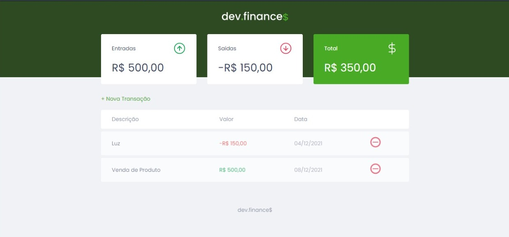

# Rocketseat - Dev.Finances

Neste repositório contém uma página simples feita com HTML, CSS e JavaScript. O intuito do desafio era fazer um cálculo onde você coloca um valor de entrada e saída que mostra o total gasto.

## Table of contents

- [Screenshots](#screenshots)
- [My process](#my-process)
  - [Built with](#built-with)
  - [What I learned](#what-i-learned)
- [Author](#author)

## Screenshots




- Solution URL: [https://github.com/RaquelPenteado/finances](https://github.com/RaquelPenteado/finances)
- Live Site URL: [https://finances-kappa.vercel.app](https://finances-kappa.vercel.app)

## My process

### Built with

- Semantic HTML5 markup
- CSS custom properties
- JS

### What I learned

```js
const Storage = {
    get() {
        return JSON.parse(localStorage.getItem('dev.finances:transactions')) || []
    },
    set(transactions){
        localStorage.setItem("dev.finances:transaction", JSON.stringify(transactions))
    }
}
```

## Author

- Twitter - [https://www.twitter.com/raquelpenteado](
